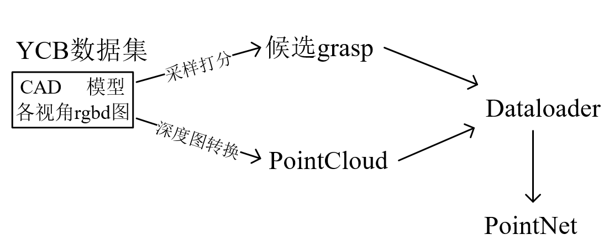
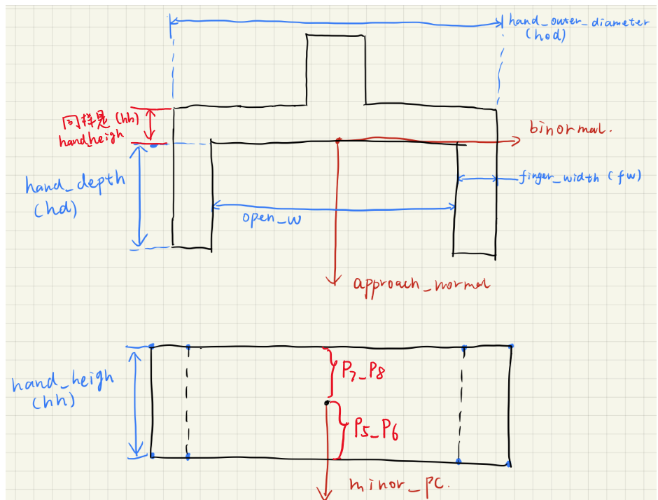
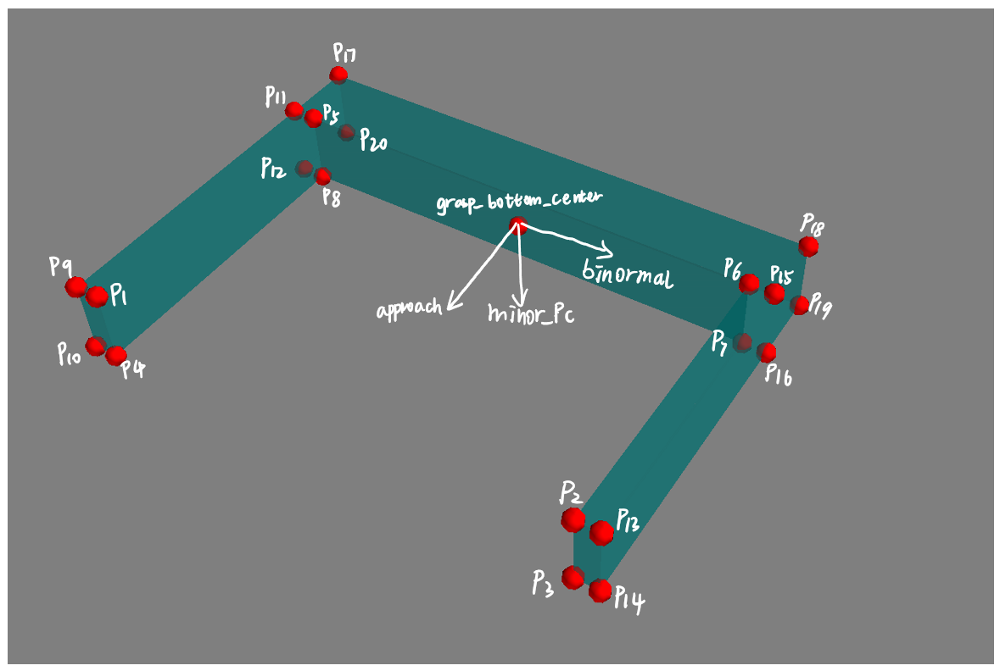

# PointNetGPD: Detecting Grasp Configurations from Point Set

感谢原作者开源：https://github.com/lianghongzhuo/PointNetGPD

PointNetGPD (ICRA 2019, [arXiv](https://arxiv.org/abs/1809.06267)) is an end-to-end grasp evaluation model to address the challenging problem of localizing robot grasp configurations directly from the point cloud.

简单介绍一下PointNet的代码流程：  
- 离线阶段

    1.  **候选抓取采样与打分：** 针对[YCB objects Dataset](http://ycb-benchmarks.s3-website-us-east-1.amazonaws.com/) 中的CAD模型，利用传统采样方法（默认Antipods采样）对进行候选抓取姿态（夹爪6D姿态）采样，并通过Force Closure结合 GWS 方法对所检测出的姿态进行打分，生成候选抓取数据集存起来备用；
    2.  **点云原始数据生成：** [YCB objects Dataset](http://ycb-benchmarks.s3-website-us-east-1.amazonaws.com/) 提供了一些物体的CAD模型，以及某些视角下这些物体的激光深度图；但是我们在训练网络时候，使用的是点云数据，因此，这里提前要把某些视角下的深度图转换为点云数据，以备后续使用；
    3.  **PointNet模型训练：** 利用生成的某候选夹爪姿态（步骤1.i），结合CAD模型的多视角点云（步骤1.ii），提取出来该候选抓取姿态下夹爪闭合区域内的点云；将夹爪闭合区域内的点云以及该抓取姿态的分数送入PointNet中进行训练；

- 在线阶段  
    1. **抓取采样：** [从点云中直接采样候选抓取姿态](https://www.researchgate.net/publication/318107041_Grasp_Pose_Detection_in_Point_Clouds) ，并剔除掉与桌面碰撞、与场景点云碰撞的非法抓取；
    2. **打分：** 提取剩余的抓取姿态夹爪内部的点，进一步剔除掉不合理的数据之后，将点集送入训练好的PointNet网络中打分；
    3. **排序：** 将候选的抓取按照分数从高到低排序，输出分数最高的抓取。


## Video
- 作者的实验视频  
[](https://www.youtube.com/watch?v=RBFFCLiWhRw)
- 本人的复现实验视频(未加速)

    [](https://www.youtube.com/watch?v=OfvJ-HpKjI4)  
在实验中发现，gpd效果还是很不错的；但是夹爪经常撞到目标物体上，这是受到了手眼标定的精度以及panda夹爪构型的影响（panda夹爪的深度比较浅，最大张开距离也比较小）
## 关于数据集

代码中数据集的生成部分比较混乱，这里解释一下具体数据集的生成逻辑：

YCB数据集主要分为两个部分，一部分是数据集物体的CAD模型，一部分是各个视角下物体的rgbd深度图，因此在前期的准备过程中，主要分为两个独立的部分：

- 对YCB数据集的CAD模型进行候选抓取姿态采样，获取候选grasp数据集；
- 对YCB数据集中各个视角的深度图像进行计算，生成该视角下的点云数据集；

之后两部分的计算结果将会被放在同一个文件夹中，Dataloader将会对该文件夹进行处理，并计算出样本数据送入PointNet中进行训练。



以下是稍微具体一些的解释图：


为了防止硬盘不够大，本代码将最终Dataloader用到的数据集，单独放在了以下目录，可以挂载到一个单独的硬盘里，详细见后文的设置

```bash
mkdir -p $HOME/dataset/PointNetGPD
```


## 本代码的修改

原代码中

离线阶段：使用Antipod算法对YCB 的CAD模型进行候选grasp pose采样，并结合夹爪数学模型和模型视角点云来生成夹爪内部点云，进而输入PointNet中训练；

在线阶段：使用基于点云的gpg算法，对场景点云进行候选grasp pose采样，并结合夹爪数学模型和场景点云来生成夹爪内部点云，进而输入PointNet中进行预测。

然而，实际代码中两个阶段使用的夹爪数学模型不一致，个人感觉统一模型会好一些，于是本代码中统一dataloader中相同的数学模型；

## Before Install

在使用前，clone的代码文件夹需要放在如下的code文件夹中:
```bash
mkdir -p $HOME/code/
cd $HOME/code/
```


## Install all the requirements (Using a virtual environment is recommended)

1. Make sure in your Python environment do not have same package named ```meshpy``` or ```dexnet```.

2. 确保已经安装了ROS以及相机预处理相关的程序包（https://github.com/Hymwgk/point_cloud_process）

3. Clone this repository:
    ```bash
    cd $HOME/code
    git clone https://github.com/hymwgk/PointNetGPD.git
    ```

4. Install our requirements in `requirements.txt` (在python2以及python3环境中都需要安装)
    ```bash
    cd $HOME/code/PointNetGPD
    pip install -r requirements.txt  #python3环境中
    pip install -r requirements2.txt  #python2环境中
    ```
    
5. Install our modified meshpy (Modify from [Berkeley Automation Lab: meshpy](https://github.com/BerkeleyAutomation/meshpy)) 
    ```bash
    cd $HOME/code
    git clone https://github.com/Hymwgk/meshpy.git
	cd meshpy
	#分别在python2和python3环境下执行一遍
    python setup.py develop  
    ```

6. Install our modified dex-net (Modify from [Berkeley Automation Lab: dex-net](https://github.com/BerkeleyAutomation/dex-net))  
    ```bash
    cd $HOME/code
    git clone https://github.com/Hymwgk/dex-net.git
    cd dex-net
    # 分别在python2和python3环境下执行一遍
    python setup.py develop 
    ```
    
7. 设置夹爪数学模型，之后离线以及在线节点的候选夹爪姿态计算都会依据此模型来生成；你可以直接在以下文件中根据自己的实际夹爪尺寸来修改对应参数。

    ```bash
    vim $HOME/code/dex-net/data/grippers/robotiq_85/params.json
    ```
    以下是`params.json`中，原作者离线阶段用到的夹爪数学模型各个参数（本代码中已经将其废弃）

    ```bash
        "min_width":      夹爪的最小闭合角度
        "force_limit":      抓取力度限制
        "max_width":     夹爪最大张开距离
        "finger_radius": 用于软体手，指定软体手的弯曲角度（弧度制），一般用不到，补上去就行了
        "max_depth":     夹爪的最大深度，竖向的距离
    ```
    以下本代码中离线训练和在线检测统一使用的夹爪参数定义:
    ```bash
        "finger_width":    夹持器的两个夹爪的“厚度”
        "real_finger_width":   也是两个夹爪的厚度，和上面写一样就行（仅仅用于显示，影响不大，不用于姿态检测）
        "hand_height":   夹爪的另一侧厚度，一会儿看图
        "hand_height_two_finger_side":   没有用到，代码中没有找到调用，所以不用管
        "hand_outer_diameter":  夹爪最大的可以张开的距离，从最外侧量（包括两个爪子的厚度）
        "hand_depth":   夹爪的竖向深度
        "real_hand_depth":   和hand_depth保持一致，代码中两者是相同的
        "init_bite":  这个是用于在线抓取检测时，定义的一个后撤距离，主要是避免由于点云误差之类的，导致夹爪和物体碰撞，以米为单位，一般设置1cm就行了
    ```

    `params.json`参数的具体定义示意图，修改后的本代码，离线的夹爪参数仅作为候选抓取姿态的采样，而不涉及到夹爪内部点云的提取。

	
      


## 对YCB数据集的CAD模型进行候选抓取姿态采样

1. 下载 YCB object set from [YCB Dataset](http://ycb-benchmarks.s3-website-us-east-1.amazonaws.com/)，该数据集提供了物体的CAD模型和一定角度下的深度图；
2. 原代码中，将YCB的数据集放在了如下位置:
    ```bash
    cd $HOME/dataset/PointNetGPD/ycb_meshes_google/objects
    ```

    如果你的Home盘分区不够大，希望换一个位置，可以:  
    >```bash
    >cd $HOME/code/PointNetGPD/dex-net/apps  
    >vim generate-dataset-canny.py
    >```
    >修改YCB dataset 路径
    >```python
    >219  #存放CAD模型的文件夹
    >220  file_dir = home_dir + "/dataset/ycb_meshes_google/objects"   #获取模型的路径  
    >```
    >也可以修改计算结果文件的存放位置
    >```python
    >61  #将gpg得到的候选抓取文件存放起来
    >62  good_grasp_file_name =  "./generated_grasps/{}_{}_{}".format(filename_prefix, str(object_name), str(len(good_grasp)))
    >```
    
    每个物体的文件夹结构都应该如下所示:
    ```bash
        ├002_master_chef_can
        |└── google_512k
        |    ├── kinbody.xml (no use)
        |    ├── nontextured.obj
        |    ├── nontextured.ply
        |    ├── nontextured.sdf (generated by SDFGen)
        |    ├── nontextured.stl
        |    ├── textured.dae (no use)
        |    ├── textured.mtl (no use)
        |    ├── textured.obj (no use)
        |    ├── textured.sdf (no use)
        |    └── texture_map.png (no use)
        ├003_cracker_box
        └004_sugar_box
        ...
    ```
3. Install SDFGen from [GitHub](https://github.com/jeffmahler/SDFGen.git):
    ```bash
    cd code
    git clone https://github.com/jeffmahler/SDFGen.git
    cd SDFGen
    sudo sh install.sh
    ```
```
    
4. 安装python pcl library [python-pcl](https://github.com/strawlab/python-pcl)，python pcl在离线训练(python3)和在线pgd(python2)时均有使用，以下要求Ubuntu18.04，PCL1.8.1（源安装在系统路径下）:
    ```bash
    git clone https://github.com/lianghongzhuo/python-pcl.git  
    pip install --upgrade pip
    pip install cython==0.25.2 #python2
    pip install cython   #python3
    pip install numpy
    cd python-pcl
    python setup.py build_ext -i  #python2和3环境中都要执行
    python setup.py develop  #python2和3环境中都要执行
```
5. 为默认路径`$HOME/dataset/PointNetGPD/ycb_meshes_google/objects/`下的.ply文件生成.sdf 文件（放在同一文件夹下）:
    ```bash
    cd $HOME/code/PointNetGPD/apps
    python read_file_sdf.py  #anaconda3环境下python3
    ```


6. 为默认路径`$HOME/dataset/PointNetGPD/ycb_meshes_google/objects/`下的CAD模型使用Antipod进行候选抓取姿态采样,以及利用ForceClosure&GWS对生成抓取姿态进行打分，这部分的执行时间极长，主要花费时间在抓取采样之上：
    ```bash
    cd $HOME/code/PointNetGPD/apps
    python generate-dataset-canny.py [prefix]   #anaconda3环境下python3
    ```

    计算结束后将会把结果以`.npy`文件形式保存在默认的`$HOME/dataset/PointNetGPD/ycb_grasp/`路径下；这里的`[prefix]`可以根据自己的夹爪类型，添加一个标签，也可以选择不加，那么就会自动被替换成为`default`

7. 作者还给出了一个根据roboticq85夹爪模型采样好的候选grasp pose结果文件: https://tams.informatik.uni-hamburg.de/research/datasets/PointNetGPD_grasps_dataset.zip  


## 对YCB数据集中各个视角的深度图像生成点云

1. 将下载的YCB数据集文件夹`ycb_rgbd`拷贝至如下路径

   ```bash
   cp  .../ycb_rgbd   $HOME/dataset/PointNetGPD/
   ```


2. 将默认路径`$HOME/dataset/PointNetGPD/ycb_rgbd/*/`下的深度图转换为点云数据，并放在`$HOME/dataset/PointNetGPD/ycb_rgbd/*/clouds`文件夹中。

   ```bash
   cd $HOME/code/PointNetGPD/apps/
   python ycb_cloud_generate.py   #anaconda3  python3
   ```


## 准备Dataloader需要的数据文件夹

此该文件夹将会提供给PointNet的Dataloader，该Dataloader将会在训练时结合候选grasp pose&点云 提取“夹爪内部的点云”（详细解释见作者论文）

1. 进入Dataloader需要的文件夹:

    ```bash
    cd $HOME/dataset/PointNetGPD/
    ```
    确保该文件夹下有如下文件
    ```
        ├── google2cloud.csv  (Transform from google_ycb model to ycb_rgbd model)
        ├── google2cloud.pkl  (Transform from google_ycb model to ycb_rgbd model)
        ├── ycb_grasp  (里面就是离线Antipod采样到的候选grasp pose)
        ├── ycb_meshes_google  (YCB dataset)
        └── ycb_rgbd  (上面已经生成了各模型各视角点云)
    ```

    其中，`ycb_grasp`文件夹需要手动创建为如下结构，对之前生成的候选抓取样本分成两部分一部分训练一部分验证（作者好像没说咋分），每个文件夹中都是之前`generate-dataset-canny.py`采样到的grasp pose（`.npy`）
    
    ```bash
    ├── ycb_grasp
    │   ├── test #
    │   └── train #(训练)
    ```


## 训练模型

1. Run the experiments:
   
    ```bash
    cd PointNetGPD
    ```

    
    Launch a tensorboard for monitoring
    ```bash
    tensorboard --log-dir ./assets/log --port 8080
	```

    and run an experiment for 200 epoch
    ```bash
    python main_1v.py --epoch 200 --mode train --batch-size x (x>1)  #anaconda3  python3
	```
    
    File name and corresponding experiment:
    ```bash
    main_1v.py        --- 1-viewed point cloud, 2 class
    main_1v_mc.py     --- 1-viewed point cloud, 3 class
    main_1v_gpd.py    --- 1-viewed point cloud, GPD
    main_fullv.py     --- Full point cloud, 2 class
    main_fullv_mc.py  --- Full point cloud, 3 class
    main_fullv_gpd.py --- Full point cloud, GPD
    ```
    For GPD experiments, you may change the input channel number by modifying `input_chann` in the experiment scripts(only 3 and 12 channels are available)

## 使用模型，执行抓取

需要注意的是：

- 为了能够脱离机械臂实物，仅仅进行GPD的实验，同时还能够相对容易地剔除掉桌面点云；代码中选择将场景点云变换到桌面标签（ar_marker_6）坐标系中，该部分的变换处理参看https://github.com/Hymwgk/point_cloud_process
- 如果使用机械臂实物（以panda为例）所有的指令运行的窗口都需要运行`source panda_client.sh`指令确保本机ROS_MASTER指向远程工控机，如果仅仅进行gpd不实际进行抓取则不需要这样做。参见https://github.com/Hymwgk/panda_moveit_config

1. （不实际抓取不需要）手眼标定并发布“手眼”变换关系，关于Panda手眼标定和发布步骤参看https://github.com/Hymwgk/panda_hand_eye_calibrate
   
    ```bash
   roslaunch panda_hand_eye_calibrate publish_panda_eob.launch
   ```
   
2. 安装预处理包

    ```bash
    cd ~/catkin_ws/src
    git clone https://github.com/Hymwgk/point_cloud_process.git
    catkin build
    ```

3. 启动点云采集与预处理
    ```bash
    roslaunch kinect2_bridge kinect2_bridge.launch publish_tf:=true  #启动相机
    roslaunch point_cloud_process get_table_top_points.launch          #启动标签追踪以及点云预处理
    ```

4. 运行感知节点  
   
    这部分就是实际使用PointNetGPD的部分，读取预处理后桌面上的目标区域点云，基于点云进行gpg，之后将夹爪内部的点云送入pointNet中打分，并以ROS消息的形式输出good grasp
    
    ```bash
    cd $HOME/code/PointNetGPD/dex-net/apps
    python kinect2grasp.py   #anaconda2  python2  需要在conda2环境中也安装pytorch
    ```
    以下是用到的参数
    ```bash
    arguments:
    -h, --help                 show this help message and exit
    --cuda                     使用CUDA进行计算
    --gpu GPU                  指定使用的GPU编号
    --load-model LOAD_MODEL    设置使用了哪个训练好的网络 (这个参数其实没有效果，被后面的model_type MODEL_TYPE覆盖了)
    --show_final_grasp         设置是否显示最终抓取（修改了多线程不显示的问题）
    --tray_grasp               not finished grasp type（还没搞好）
    --using_mp                 是否使用多线程去进行抓取采样
    --model_type MODEL_TYPE    从三种模型中选择使用哪个模型
    ```
    举个栗子：
    ```bash
    python kinect2grasp.py  --cuda  --gpu  0  --load-model  ../data/1v_500_2class_ourway2sample.model   --using_mp   --model_type   750
    ```


------

​																					        **以下是使用机械臂进行真正的抓取执行需要的步骤，可以不做**

5. 安装ROS抓取消息包
   
    ```bash
    cd ~/catkin_ws/src
    git clone https://github.com/TAMS-Group/gpd_grasp_msgs.git
    cd ..
    catkin build
    ```
    
6. 获取机械臂当前状态，并准备接收生成的抓取（以franka panda为例）需提前安装`panda_go_grasp`包，参见https://github.com/Hymwgk/panda_go_grasp
    向ROS参数服务器发布一个参数，指明机械臂的当前是在移动状态还是已经返回home状态，机械臂在移动时，将暂时禁止gpd。

    ```bash
    roslaunch panda_go_grasp state_checker.launch  #anaconda2  python2
    ```

7. 执行抓取

    ```bash
    roslaunch panda_go_grasp go_grasp.launch  #anaconda2  python2
    ```

    

    

## 辅助工具：查看之前采样的候选grasp pose（可跳过）
- Visualization grasps
    ```bash
    cd $HOME/code/PointNetGPD/dex-net/apps
    python read_grasps_from_file.py    #anaconda3  python3
    ```

    Note:

- This file will visualize the grasps in `$HOME/code/PointNetGPD/PointNetGPD/data/ycb_grasp/` folder
  
- Visualization object normals
    ```bash
    cd $HOME/code/PointNetGPD/dex-net/apps
    python Cal_norm.py     #anaconda3  python3
    ```

This code will check the norm calculated by meshpy and pcl library.


## Citation
If you found PointNetGPD useful in your research, please consider citing:

```plain
@inproceedings{liang2019pointnetgpd,
  title={{PointNetGPD}: Detecting Grasp Configurations from Point Sets},
  author={Liang, Hongzhuo and Ma, Xiaojian and Li, Shuang and G{\"o}rner, Michael and Tang, Song and Fang, Bin and Sun, Fuchun and Zhang, Jianwei},
  booktitle={IEEE International Conference on Robotics and Automation (ICRA)},
  year={2019}
}
```

## Acknowledgement
- [gpg](https://github.com/atenpas/gpg)
- [gpd](https://github.com/atenpas/gpd)
- [dex-net](https://github.com/BerkeleyAutomation/dex-net)
- [meshpy](https://github.com/BerkeleyAutomation/meshpy)
- [SDFGen](https://github.com/christopherbatty/SDFGen)
- [pyntcloud](https://github.com/daavoo/pyntcloud)
- [metu-ros-pkg](https://github.com/kadiru/metu-ros-pkg)
- [mayavi](https://github.com/enthought/mayavi)

